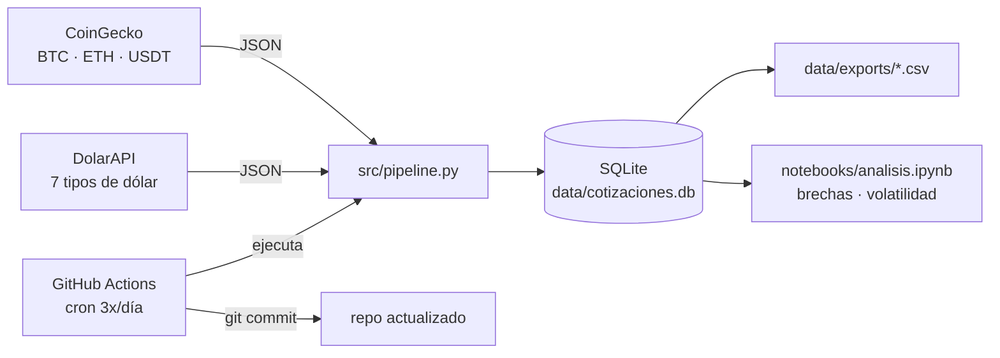
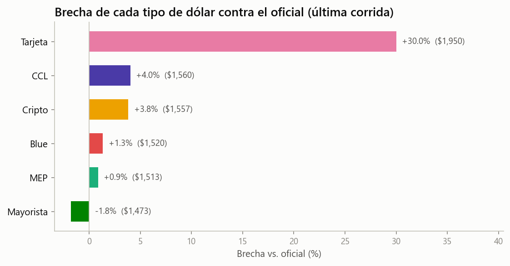

# Monitor de dólar y cripto en Argentina 🇦🇷

**Pipeline automatizado que construye su propio dataset: cada día consulta las
cotizaciones del dólar y los precios cripto en Argentina, los guarda en SQLite
y commitea la base actualizada — sin servidores, solo GitHub Actions.**

Argentina convive hace décadas con regímenes cambiarios cambiantes que hacen que
un mismo dólar cotice a varios precios a la vez (oficial, blue, MEP, CCL, cripto,
tarjeta). La **brecha** entre esos precios es un termómetro de expectativas de la
economía — y una serie temporal que vale la pena coleccionar.

## Qué hace

3 veces por día (9:00, 13:00 y 18:00 hora argentina), GitHub Actions:

1. Consulta [DolarAPI](https://dolarapi.com) → las 7 cotizaciones del dólar (compra/venta).
2. Consulta [CoinGecko](https://docs.coingecko.com) → BTC, ETH y USDT en USD y ARS.
3. Agrega las filas nuevas a `data/cotizaciones.db` (SQLite, append-only).
4. Exporta la base a CSV (`data/exports/`) y commitea todo al repo.

Si una fuente está caída, la otra se guarda igual; cada corrida queda registrada
en el log del workflow.



## Análisis

El notebook [`notebooks/analisis.ipynb`](notebooks/analisis.ipynb) analiza la
serie acumulada: brechas cambiarias (blue/MEP/CCL vs. oficial y el "canje"
CCL/MEP), la comparación del dólar cripto local contra el precio implícito de
USDT según CoinGecko, y la volatilidad comparada entre tipos de dólar. Está
diseñado para crecer con el dataset: con pocos días muestra la foto actual, y
las secciones de series y volatilidad se activan solas al re-ejecutarlo cuando
hay historia suficiente.



## Hallazgos

*Esta sección se completa a medida que el dataset acumula historia.*

- **(Desde el día 1)** El precio "en pesos" que reporta CoinGecko para USDT no es
  el precio local: al convertir por su tipo de cambio de referencia queda pegado
  al mayorista, mientras que el dólar cripto de los exchanges argentinos corre
  varios puntos arriba. La diferencia entre ambos es, en sí misma, una medida de
  la brecha.

## Cómo correrlo localmente

```bash
git clone https://github.com/francomlastra/monitor-dolar-cripto.git
cd monitor-dolar-cripto

python -m venv .venv
.venv\Scripts\activate        # Windows  ·  source .venv/bin/activate en Linux/Mac
pip install -r requirements.txt

# Una corrida de ingesta (agrega filas a data/cotizaciones.db)
python -m src.pipeline

# El análisis
jupyter notebook notebooks/analisis.ipynb
```

No hace falta ninguna credencial: ambas APIs son públicas. (Opcional: si definís
la variable de entorno `COINGECKO_API_KEY` con una key gratuita del plan Demo,
el pipeline la usa automáticamente.)

## Estructura del repo

```
monitor-dolar-cripto/
├── .github/workflows/
│   └── actualizar_datos.yml   # cron 3x/día + commit de los datos
├── data/
│   ├── cotizaciones.db        # la base (SQLite, versionada a propósito)
│   └── exports/               # CSV regenerados en cada corrida
├── notebooks/
│   └── analisis.ipynb         # brechas, cripto vs USDT, volatilidad
├── src/
│   ├── extract.py             # llamadas a las APIs (timeouts, reintentos, logging)
│   ├── db.py                  # esquema SQLite, inserts append-only, export CSV
│   ├── pipeline.py            # orquestación: una fuente caída no frena al resto
│   └── viz.py                 # paleta y estilo de los gráficos
├── reports/figures/
├── requirements.txt
└── NOTES.md                   # decisiones de diseño y mejoras futuras
```

Las decisiones de diseño (por qué SQLite, por qué commitear la base, cómo agregar
una fuente nueva) están explicadas en [`NOTES.md`](NOTES.md).

---

**Franco Lastra** · Analista de Datos ·
[francomlastra.github.io](https://francomlastra.github.io) ·
Datos: [DolarAPI](https://dolarapi.com) y [CoinGecko](https://www.coingecko.com)
